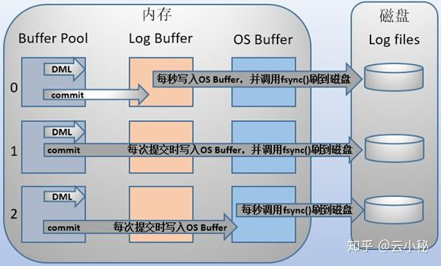

## MySql日志

* [mysql的日志](#mysql的六种日志)
* [bin log](#二进制日志)
* [redo log](#重写日志)
* [undo log](#回滚日志)
* [slow query log](#慢查询日志)
* [error log](#错误日志)
* [general log](#一般查询日志)
* [relay log](#中继日志)

### mysql的六种日志

MySQL中存在着以下几种日志：二进制日志（bin log）、重写日志（redo log）、回滚日志（undo log）、慢查询日志（slow query log）、错误日志（error log）、一般查询日志（general log）、中继日志（relay log）。

### 二进制日志

记录mysql数据更新的sql语句。主要用来主从复制（master开启binlog,master把他的binlog日志传递给slaves并回放来达到master-slave数据一致）、数据恢复、增量备份。

### 重写日志

数据库存放数据的文件为data file,日志文件为log file,数据库的缓存称为data buffer,日志的缓存称为log buffer;
对数据库来说，数据不是最重要的，日志才是最重要的；事务提交会将事务的所有日志写入到磁盘上的redo log file中进行持久；
重写日志redo和回滚日志undo是InnoDB的事务日志，保证事务的ACID特性。
从redo log buffer写日志到磁盘的redo log file中，过程如下:

mysql支持用户自定义commit时如何将log buffer的日志刷到log file中，通过自定义变量innodb_flush_log_at_trx_commit，改值的取值范围为0，1，2，默认为1；
当设置我0时，事务提交时不会将log buffer中的日志写到os buffer中，而是每秒写入os buffer并调用fsync()写入log file on disk中。也就是每秒刷新写入磁盘中，当系统崩溃，会丢失一秒钟数据；
当设置为1时，每次提交事务都会将log buffer中的日志写到os buffer并调用fsync()将数据写入log file on disk。因为这种方式每次提交都写入了磁盘，所有性能比较差；
当设置为2时，每次提交事务都会将log buffer中的日志写到os buffer,然后每秒调用fsync()将os buffer中的日志持久话到log file。

用来在MySQL宕机情况下将不完整的事务执行数据纠正，redo日志记录事务执行后的状态。当事务开始后，redo log就开始产生，并且随着事务的执行不断写入redo log file中，redo log file中记录了xxx页做了xx修改的信息。

### 回滚日志

在修改数据的时候不仅记录的redo log，也记录了undo log，但undo log和redo log记录物理日志不一样的是，他记录了逻辑日志。可以认为当delete一条记录时，undo log会记录一条对应的insert记录，反之亦然。

undo log的两个作用：提供回滚和多个版本并发控制（MVCC）。

当执行rollback的时，就可以从undo log中的逻辑记录读取到相应的内容并进行回滚。当读取某一行被其他事务锁定时，它可以从undo log分析出该行记录之前的数据是什么，从而提供改行版本信息，让用户实现非锁定一致性读取。

### 慢查询日志

慢查询日志（slow query log） 会记录查询超过一定时间的语句，方便问题定位分析、性能优化。
可以设置查询的超时记录时间（long_query_time），也可以设置在不使用索引（log_queries_not_using_indexes）时记录。

### 错误日志

记录mysql服务运行过程中的错误信息

### 一般查询日志

记录mysql的日常，包括查询、修改、更新的每条sql，因为所有的语句都会在general log记录，所以文件比较大，mysql默认关闭。

### 中继日志

中继日志（relay log）是复制过程中产生的日志和binary log 差不多，区别是relay log是从库服务器将主库服务器的binary log拉取过来，
记录在从库服务器的本地文件，然后从库服务器读取relay log应用到从库服务器上。
