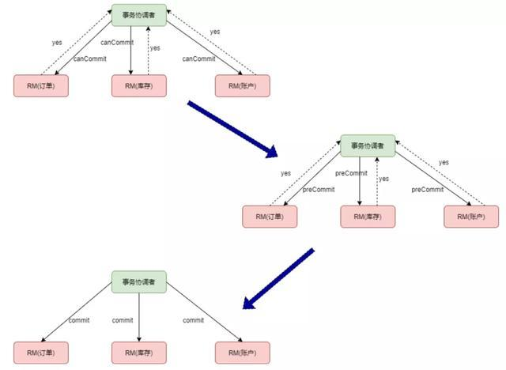

## 分布式事务

* [分布式事务](#分布式事务)
* [分布式事务方案](#分布式事务方案)
  * [XA协议](#XA协议)
    * [2PC](#2PC)
    * [3PC](#3PC)
  * [TCC]
  * [AT模式]

### 分布式事务

事务的参与者、支持事务的服务器、资源服务器以及事务管理器分别位于不同节点之上，多个数据源的事务处理机制，
分布式事务需要保证这些操作的一致性。

### 分布式事务方案

把多个服务的访问都能纳入到同一个事务当中

#### XA协议

XA 协议是由 X/Open 组织提出的分布式事务处理规范，主要定义了事务管理器 TM 和局部资源管理器 RM 之间的接口。
目前主流的数据库，比如 oracle、DB2、MySql 都是支持 XA 协议的。

#### 2PC

两阶段提交是把整个事务分为两个阶段： prepare 阶段和 commit 阶段。
以常见电商系统为例，分布式系统中有订单、账户和库存三个服务，如下图：

第一阶段，事务协调者向事务参与者发送 prepare 请求，事务参与者收到请求后，如果本地可以提交事务，回复 yes，否则回复 no。

第二阶段，如果所有事务参与者都回复了 yes，事务协调者向所有事务参与者发送 commit 请求，否则发送 rollback 请求。

存在问题：

- 同步阻塞：本地事务在prepare阶段锁定资源，其他事务要修改资源就要等前面事务完成
- 数据不一致：如果prepare阶段成功了，第二阶段TM向RM发送命令时失败，就会导致数据不一致
- TM单节点故障：如果prepare阶段成功后，在第二阶段发送命令之前宕机，所有服务的当前事务资源就会一直处于等待状态

#### 3PC

为解决两阶段提交的问题，三阶段提交做了改变：

- 协调者和参与者都引入了超时机制
- 第一阶段prepare阶段分成两步，canCommi 和 preCommit。

如下图：

存在问题：
多了一次网络通信，性能上变得更差；引入preCommit后，协调者在发送commit之前再次检测各个事务参与者状态，保证他们的状态是一致的，
但也存在问题，如果第三阶段协调者发出rollback命令，有参与者没有收到，那没有收到的节点会在超时后自动提交，造成数据不一致。

#### TCC

TCC 分别指 Try、Confirm、Cancel ，一个业务操作要对应的写这三个方法。